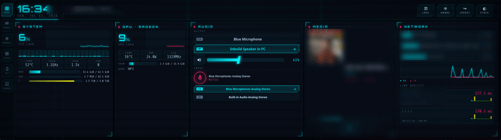
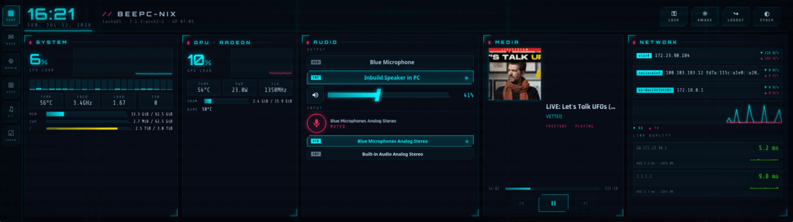
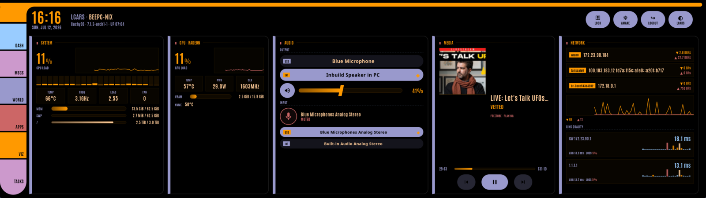
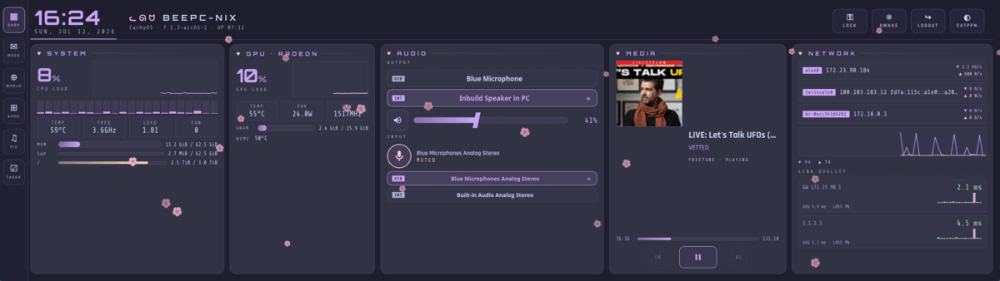
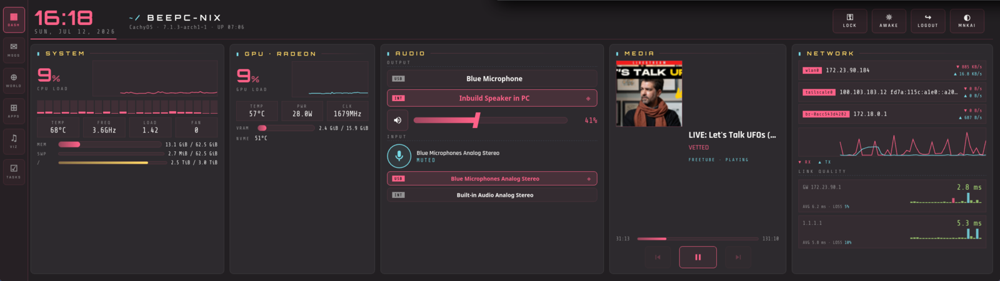
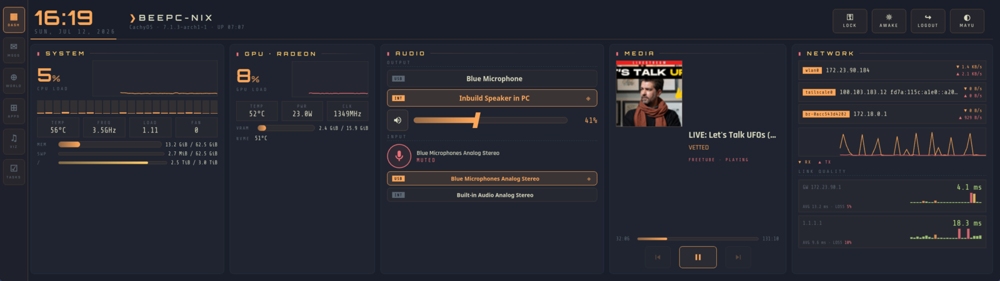
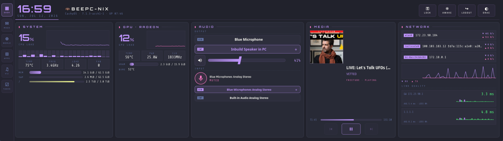

# Dashpunk

**A Linux cyberdeck for the Corsair Xeneon Edge.**

An open-source, cyberpunk-themed touch dashboard for the **Corsair Xeneon Edge**
(2560×720 touchscreen) on Linux. Corsair doesn't ship Linux software for the
Edge, but since it's just a secondary monitor with a USB HID touchscreen,
Dashpunk turns it into a proper system deck.

Built and tested on **CachyOS** with both **GNOME (Wayland, USB-C)** and
**KDE Plasma 6 (Wayland, HDMI)**. The video link can be HDMI or USB-C
(DisplayPort alt mode). Only the connector name in the config changes; touch
always comes over the USB cable.

<p align="center">
  
</p>

<!-- optional extra hero: a desk photo of the Edge running Dashpunk as img/hero.png -->

## Features

- **System**: CPU load + per-core bars, frequency, temperature (k10temp),
  memory/swap, disk usage, fan RPM (when exposed via hwmon)
- **GPU**: utilization, VRAM, temperature, power draw, clock (AMD via sysfs)
- **Audio**: output device switcher (tap to switch between e.g. Bluetooth
  headset and speakers), touch volume slider, output mute, big mic mute button
  (PipeWire/PulseAudio via `pactl`)
- **Media**: now playing with album art and play/pause/skip for any MPRIS
  player (Spotify, Firefox, mpv, …)
- **Network**: interface IPs, live RX/TX throughput graph, ping latency +
  packet loss monitoring against your gateway and any hosts you configure
- **Quick actions**: lock screen, do-not-disturb, keep-awake, plus custom
  command buttons
- **Calendar agenda**: upcoming meetings from any published ICS link
  (Outlook 365, Google Calendar, Nextcloud…): recurring events, timezones and
  rescheduled instances handled; NOW/soon highlighting; plus a next-meeting
  countdown chip in the header. Configure `[calendar] ics_url` in the config
  file. Treat that URL as a secret: anyone with it can read your calendar.
- **World clocks page**: live clocks for any set of cities (day/night
  tinting), current weather via OpenWeather (free API key), and public
  holidays via [Nager.Date](https://date.nager.at) (no key, ~100 countries,
  supports sub-national regions like `US-GA`): a banner on the day itself and
  a next-holiday countdown per city.
- **App launcher page**: StreamDeck-style touch tiles that run any shell
  command: launch apps and Flatpaks, open URLs in a browser, or fire terminal
  macros (e.g. `step-cli ssh login` in a Ghostty window). Icons live in
  `ui/icons/`; [selfh.st/icons](https://selfh.st/icons/) is a great source.
- **Messages page**: captures Microsoft Teams and Mattermost desktop
  notifications (D-Bus monitor, works with teams-for-linux and the Mattermost
  desktop app) into per-app columns with tap-to-dismiss, clear buttons, and an
  unread badge on the nav rail. Swipe or tap the left rail to switch pages.
  Sources/filters are configurable: any notifying app can get a column.
- **Audio visualizer page**: Winamp-plugin-style visualizer reacting to
  whatever plays on the default output (captured via `parec` on the sink
  monitor, no extra packages). Six modes cycled by tapping: spectrum bars,
  oscilloscope, radial spectrum, hyperspace starfield, wormhole tunnel, and a
  MilkDrop-style feedback warp. Album art, track info and transport controls
  overlay the corner, including a **Spotify like button** (also on the dash
  media panel): create a free app at
  [developer.spotify.com](https://developer.spotify.com/dashboard) with
  redirect URI `http://127.0.0.1:8898/callback`, put its Client ID under
  `[spotify]` in the config, and tap LINK on the dashboard once. Audio
  capture only runs while the page is visible.
- **Tasks page**: [Taskwarrior](https://taskwarrior.org) pending tasks
  sorted by urgency, with tag/project filter chips and overdue highlighting.
  Tap ✓ to complete a task (5-second undo window before it commits). The
  task filter is configurable via `[tasks] filter` in the config.
- Fullscreen, borderless, touch-first, and it finds the Edge by its DRM
  connector, no window dragging needed

See [FEATURES.md](FEATURES.md) for the full feature tour.

A note on the integrations: they are opinionated toward my own workflow
(Taskwarrior for tasks, Teams and Mattermost notification capture, an Outlook
ICS link for the agenda, a Spotify like button). Every one of them is
optional and off or empty by default; the notification sources take arbitrary
match patterns, the calendar accepts any published ICS link, and the tasks
filter is any Taskwarrior expression. If you skip the config keys, the pages
simply stay empty.

## Project status and contributions

This is a personal project built first and foremost for my own desk and my
own workflow, and it will stay opinionated in that direction. I am sharing
it because it might be useful to other Edge owners, not because I can
promise upstream support.

Apologies in advance: issues and pull requests may sit for a while, and some
may never be picked up, because I work on my projects as time and interest
allow. Please do not read silence as rejection. If the pace here does not
match yours, forking is a first class option, not a rude one: the GPLv3
exists exactly so you can take this, change it, and carry it forward, as
long as your version stays under the same license.

## Requirements

Arch/CachyOS package names:

```
sudo pacman -S gtk4 webkitgtk-6.0 python-gobject python-psutil libpulse
```

## Install

```
./install.sh            # install & configure (idempotent, safe to re-run)
./install.sh --verify   # read-only health check of an existing setup
```

The installer detects which connector the Edge is on (HDMI or
USB-C/DisplayPort) and syncs it into the config, checks the touch controller
is on USB, maps the touchscreen to the Edge display on **GNOME and KDE
Plasma 6**, installs the udev fix (asks for sudo once, only when needed),
and adds an app-menu entry + autostart on login. Every step reports
✔/⚠/✗ with a summary table at the end.

Re-run it any time: already-configured steps are detected and skipped, and
anything that drifted (moved repo, changed connector) is fixed. `--verify`
does the same checks read-only and exits non-zero on failure. On niri it
prints the `config.kdl` snippet to add (automatic support planned).

Run the app manually with `./dashpunk`.

> Upgrading from when this project was named "xeneon-edge"? Just re-run
> `./install.sh`; it migrates your config dir and replaces the old
> autostart/app-menu entries.

## Configuration

`~/.config/dashpunk/config.toml` (created with defaults on first run). A
fully commented starter with example apps, cities and radio stations lives in
[`config.example.toml`](config.example.toml); copy it over to hit the ground
running:

```
cp config.example.toml ~/.config/dashpunk/config.toml
```

```toml
[display]
connector = "HDMI-A-1"      # HDMI; use "DP-2" etc. for USB-C/DisplayPort
model_match = "XENEON EDGE" # fallback match on monitor model
hide_cursor = true

[network]
ping_targets = ["gateway", "1.1.1.1"]

[[actions.custom]]
label = "Files"
icon = "▣"
command = "nautilus"
```

## Themes

Six built-in themes, switchable live from the **THEME** button in the header
(it cycles, no restart needed). Adding a theme is a single CSS block plus one
registry entry; the palette, shapes, glows, canvas graphs and all six
visualizer modes follow automatically.

### cyberpunk (default)

The neon look: glows, CRT scanlines, angular corner-cut controls, and an
occasional simulated GPU glitch (a brief flicker/tear, one or two per
~20 minutes; disable with `[ui] glitches = false`).



### lcars

A Star Trek LCARS console: black canvas, golden-orange elbow chrome joining
a segmented color rail, pill controls with black labels, Antonio typography.



### catppuccin

Catppuccin Mocha pastels with rounded corners and kitty accents ᓚᘏᗢ, plus
ambient charm: slow sakura showers and, every so often, a trail of paw
prints wandering across the screen.



### monokai

Monokai Pro: the classic editor palette (pink, cyan, green, yellow on warm
charcoal), flat and understated.



### mayukai

After the [Mayukai Mirage](https://github.com/GulajavaMinistudio/Mayukai-Theme)
VSCode theme (Ayu Mirage lineage): warm orange and coral on deep blue-slate.



### dracula

The classic vampire palette on `#282a36`, colors straight from the official
[Dracula specification](https://draculatheme.com/contribute): purple primary,
pink secondary, green/yellow status. 🦇



### Choosing and persistence

Set the startup default with `[ui] theme = "..."` in the config. The last
choice made with the THEME button is stored in
`~/.config/dashpunk/state.json` and wins over the config value; delete that
file to fall back to the config.

The LCARS theme bundles the Antonio font (SIL Open Font License), alongside
the existing OFL fonts (Orbitron, Rajdhani, Share Tech Mono).

## Keyboard shortcuts (when focused)

| Key | Action |
|-----|--------|
| `F11` | Toggle fullscreen (handy for windowed debugging) |
| `F12` | Open the WebKit inspector |
| `Ctrl+Q` | Quit |

## Touchscreen mapping

The Edge's touch controller (`27c0:0859`, "wch.cn TouchScreen") can't be
auto-matched to the Corsair display, so desktops may map touch coordinates to
the wrong monitor. `install.sh` fixes this automatically on GNOME **and KDE
Plasma 6**: see [docs/TOUCHSCREEN.md](docs/TOUCHSCREEN.md) for the full
technical breakdown. To do it manually on GNOME, find your display's EDID
identity and set:

```
gsettings set org.gnome.desktop.peripherals.touchscreen:/org/gnome/desktop/peripherals/touchscreens/27c0:0859/ output "['CRX', 'XENEON EDGE', '<your serial>']"
```

On KDE Plasma 6 (Wayland): System Settings → Mouse & Touchpad → Touchscreen →
select *wch.cn TouchScreen* and map it to the Edge display. Note that KWin
keys this binding by the display's **UUID**, so hand-editing only `OutputName`
in `kcminputrc` won't stick. Use the GUI (or the D-Bus one-liner in
[docs/TOUCHSCREEN.md](docs/TOUCHSCREEN.md#kde-plasma-6-kwinwayland)) and KWin
writes both keys for you.

The controller also exposes a legacy mouse-emulation HID interface that can
cause phantom pointer behaviour. `install.sh` hides it from libinput with the
bundled udev rule (and verifies it's actually active); to do it by hand:

```
sudo cp udev/99-xeneon-edge-touch.rules /etc/udev/rules.d/
sudo udevadm control --reload-rules   # then replug the Edge's USB cable
```

## KDE Plasma notes

- Fullscreen-on-monitor works on KWin Wayland the same way.
- The DND toggle uses GNOME's `gsettings` on GNOME; on Plasma it calls the
  notification inhibition D-Bus interface (best-effort).
- Everything else (audio, MPRIS, stats, network) is desktop-agnostic.

## How it works

A small Python GTK4 app fullscreens a WebKitGTK webview on the monitor whose
DRM connector matches the config. A background thread collects stats (psutil +
sysfs + `pactl` + MPRIS over D-Bus) once a second and pushes JSON into the
page; touch interactions post messages back over the WebKit script-message
bridge.

## License

[GPLv3](LICENSE). Copyright (c) 2026 karubits. You are free to use, study,
modify and redistribute Dashpunk; distributed derivatives must remain open
source under the same license. Fonts (Orbitron, Rajdhani, Share Tech Mono,
Antonio) are bundled under the
[SIL Open Font License](https://openfontlicense.org/).

## Disclaimer

Dashpunk is an independent community project, not affiliated with or endorsed
by Corsair. "Corsair" and "Xeneon" are trademarks of Corsair Memory, Inc.
This software touches no Corsair firmware or software; it uses only standard
Linux kernel and desktop APIs (DRM/EDID, HID, libinput, compositor D-Bus).

Development of this project was supported by Fable (Anthropic's Claude).
